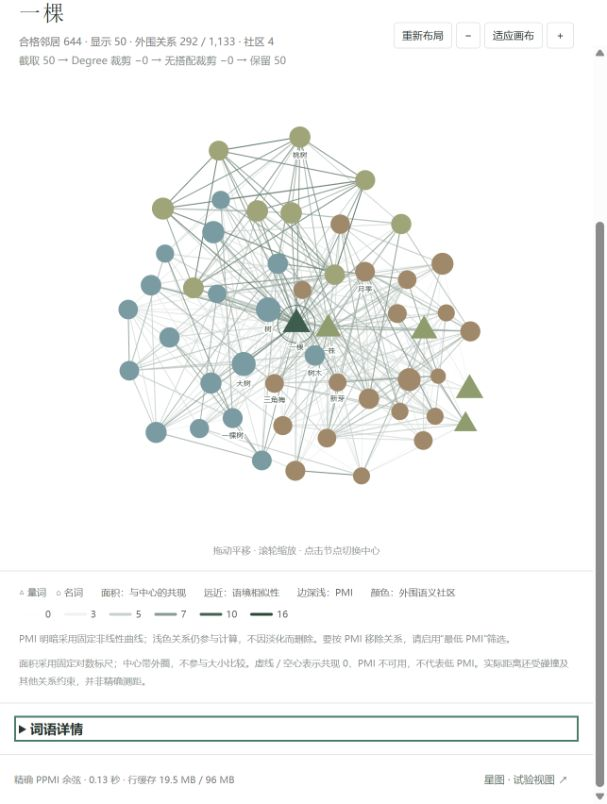

# 中文量词语义网络

## 版本与存档

- `main`：完整数据新版正式站点，构建时从固定 GitHub Release 下载并校验数据。
- [`archive/original-20260905`](https://github.com/aewtsow/semanticnetwork/tree/archive/original-20260905)：同步前旧版的完整快照，对应提交 [`ba651c2`](https://github.com/aewtsow/semanticnetwork/commit/ba651c29b01d50869ec65eadb3b888e57dd2a98a)，包含原三图、星图及原有数据。
- [`archive/pre-lossless-20261006`](https://github.com/aewtsow/semanticnetwork/tree/archive/pre-lossless-20261006)：本次无损传输改造前的新版代码快照，对应 `071c2cd`；完整原始数据另有本地 ZIP 存档。
- `preview/lossless-20261006`：保留 2026-10-06 完整双精度数据的独立预览版本；新版入口为 `index.html`，旧版对照为 `legacy.html`。

新版统一节点共现面积、完整语境 PPMI 余弦目标距离和 PMI 明暗。
弱连接采用固定的 `sigmoid((PMI − 5) / 2)²` 白到深绿色阶，不因此移除关系。
包含裁剪阈值、同词类外围社区、中心切换动效及三栏工作台；星图保留旧数据和算法。

## 本地运行与数据依赖

完整精确相似性有 23,231 个二进制行，合计 8,634,869,776 字节（约 8.63 GB）。
它们不放进 Git 历史，也不会退回旧近似值冒充新版结果。已生成 23 个无损发布分包，
合计 3,887,984,640 字节（约 3.89 GB），全部原始行逐字节还原通过。
`data/semantic_v2/manifest.json` 记录源校验、精度、固定标尺和行格式。

线上构建使用 GitHub Release `semantic-data-v2-lossless-20261006` 的附件，版本与校验值由
`data/semantic_v2/release-lock.json` 固定。`vercel.json` 自动执行下载、校验与组装，浏览器
Worker 按需解压，不改变数据精度、筛选、聚类或布局。Release 完整上传后才可部署。
Production 构建仅允许 main 分支；其他分支仍用于 Preview。
操作方法见 [无损发布与预览说明](RELEASE_DEPLOYMENT.md)。

已有本地数据时，将同版本行文件保留/恢复至 `data/semantic_v2/rows/`，再执行：

```powershell
python serve_semantic_v2.py --port 8765
```

打开 `http://127.0.0.1:8765/?v=20261005-1`。不要直接双击 HTML。
用户现有 Windows 工作区也可使用 `run-semantic-v2.ps1 serve`，它使用 codex conda 环境并把临时目录放在工作区。

只有代码、没有完整行文件时，新图会明确报数据不可用；`legacy.html` 和原星图仍使用仓库中的旧数据。
无损完整数据已由独立预览验证；2026-10-07 按用户要求将新版同步到 main 正式部署。
仍需留意账户存储/流量额度，400 邻居的全部边模式仍较重。

从头生成还需要未随仓库公开的原语料与已有完整关系缓存，不是仅克隆仓库即可执行：

- 保持研究目录 `ProjectRoot/FQL/semantic_network`、`ProjectRoot/Data`、`FQL/valid_common.xlsx` 的相对结构。
- 原语料 `Data/cor_m_sum.npz` 与 `build_cache/word_network_full/` 的完整同类关系缓存及索引必须匹配 manifest 所对应的词表。
- Python 需 NumPy、SciPy、pandas；浏览器依赖的 Graphology 已在 `vendor/` 内。
- 准备好这些输入后运行 `run-semantic-v2.ps1 build`；不要运行旧生成脚本覆盖本次固定词表或已验证数据。

## 验证与说明

2026-10-07：社区使用更高饱和度的分类色。外围关系新增“自定义合格关系”：
先按相似性严格大于阈值筛选，再合并每个外围节点最强 X 条连接（X 为 1–400 的整数）。
仅影响显示边；节点、中心连接、度数裁剪、社区及布局骨架保持原口径。
默认仍是每个节点最强 8 条的并集。运行 `node test_peripheral_display.js` 验证。

完整回归（需要本地完整行数据、生成缓存、Python 和 Node.js）：

```powershell
.\run-semantic-v2.ps1 test
```

无需完整语料的合成回归可单独运行 `node test_semantic_restore.js`。
弱边淡化的 18 组新旧对照确认节点、关系、社区和最终坐标完全一致，除 RGB 外无模型变化。
400 邻居的全部边仍有明显绘制负载，不保证流畅帧率。

- [方法、数据和复现细节](SEMANTIC_V2.md)
- [与旧版功能的差异](RESTORE_AUDIT.md)
- [测试结果](test_artifacts/semantic_v2/)


